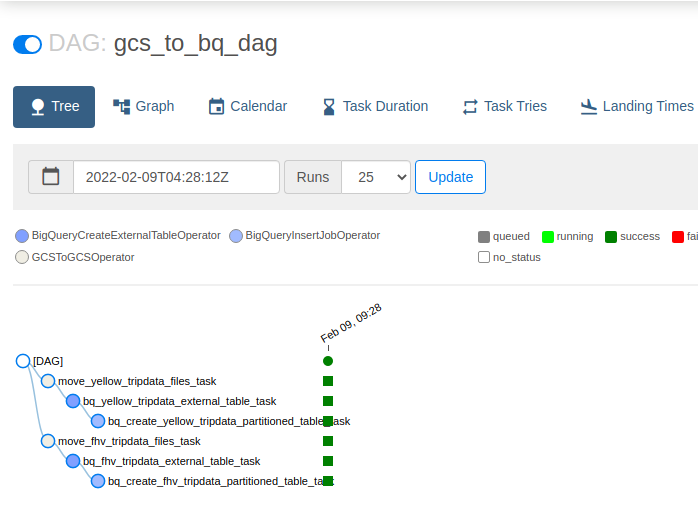
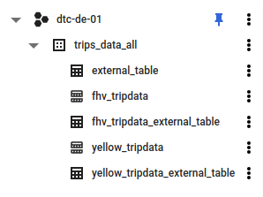
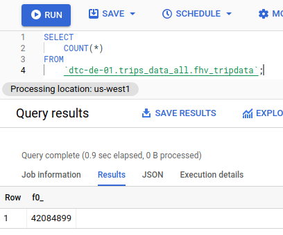
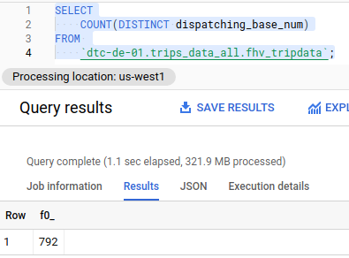
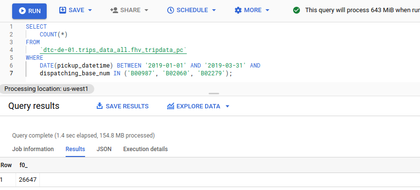

# DEZ Week 3


# Screenshots

Running the GCS to BQ DAG



Creation of Tables 




# Q1


```SQL
SELECT
    COUNT(*)
FROM 
    `dtc-de-01.trips_data_all.fhv_tripdata`;
```


# Q2




```SQL
SELECT
    COUNT(DISTINCT dispatching_base_num)
FROM 
    `dtc-de-01.trips_data_all.fhv_tripdata`;
```

# Q3

Partition by dropoff_datetime and cluster by dispatching_base_num

# Q4




```SQL
--Create Partitioned and Clustered Table
CREATE OR REPLACE TABLE 
	dtc-de-01.trips_data_all.fhv_tripdata_pc
PARTITION BY 
	DATE(dropoff_datetime)
CLUSTER BY 
	dispatching_base_num
AS
SELECT * FROM `dtc-de-01.trips_data_all.fhv_tripdata`;
```
```SQL
SELECT
    COUNT(*)
FROM 
    `dtc-de-01.trips_data_all.fhv_tripdata_pc`
WHERE
    DATE(pickup_datetime) BETWEEN '2019-01-01' AND '2019-03-31' AND 
    dispatching_base_num IN ('B00987', 'B02060', 'B02279');
```


# Q5

Cluster by dispatching_base_num and SR_Flag

# Q6

No improvements  
Can be worse due to metadata

# Q7

Columnar